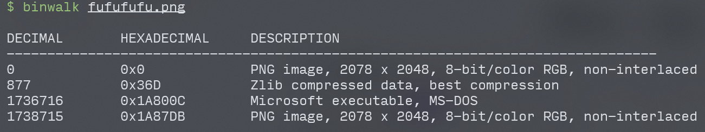
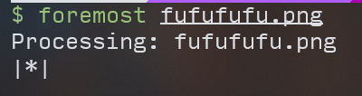
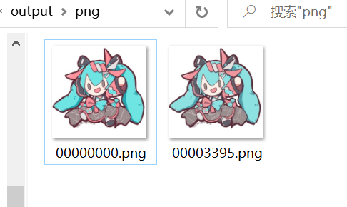

# Misc - wp

原文链接：[【wp】2021Sloth选拔赛 | c10udlnk_Log](https://c10udlnk.top/p/wpFor-2021SlothTrial/)

## Where is my fufu?

图片名字`fufufufu.png`说明这一张图片里有两个fufu，需要把这个图片合并的东西拆出来，而且Hint里也有提binwalk不是万能的，那可以试试binwalk，虽然可以扫到但`-e`分不出来（binwalk一下——图片隐写常规套路了）

所以用另一个拆分的软件`foremost`（硬件里经常用

就可以在`output/png`里找到两张图片：

然后这里有提示说是两张一样的图片 ~~（老婆）~~，这时候就要试试盲水印了。

（注意，盲水印有很多种不同的版本，一个拆不出来可以多试几个，毕竟你也不知道出题人用的是哪个）

这里的盲水印用的是[chishaxie/BlindWaterMark: 盲水印 by python](https://github.com/chishaxie/BlindWaterMark)，用这个脚本直接解就能得到：

flag：**flag{T0ver_sto1e_my_FUFU_-TAT-}**

