# Reverse - write up

原文链接：[【wp】2021Sloth选拔赛 | c10udlnk_Log](https://c10udlnk.top/p/wpFor-2021SlothTrial/)

## Guess

签到题，主要难点估计在去除花指令上。

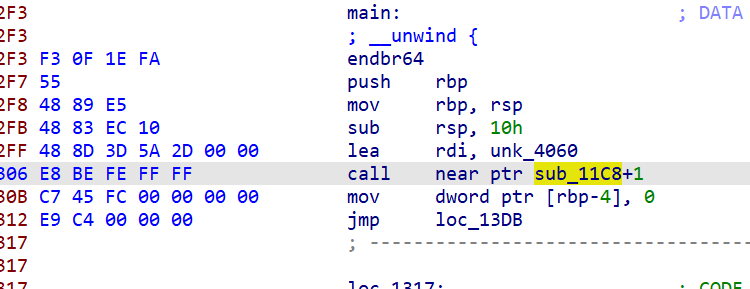

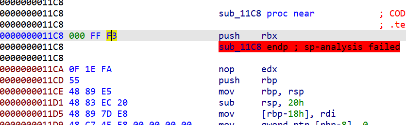

这里是函数没有识别正确，跳过去重新转一下函数就好（按`u`把这一段undefined掉，然后重新`p`生成函数）

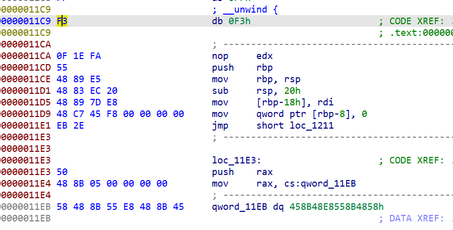

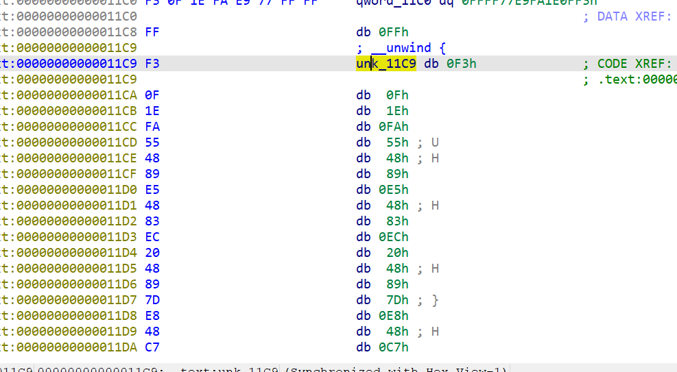

下面没有识别出来的手动按`c`转代码

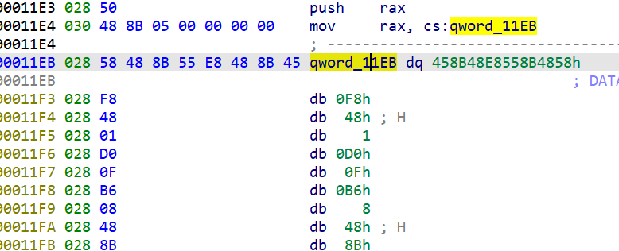

然后反编译出了`sub_11C9()`，可以看到最后是puts结尾，猜测只是一个混淆输出，与程序逻辑没什么关系。

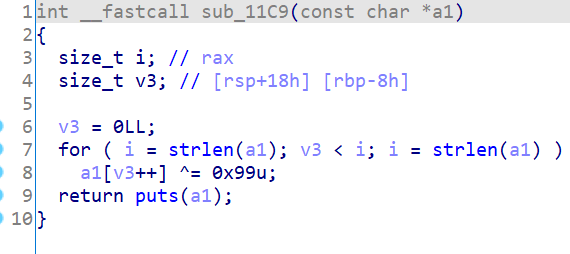

主函数这边有两个经典的`call $+5`式花指令，在[RE套路 - 关于逆向常客花指令 | c10udlnk_Log](https://c10udlnk.top/p/reSkillsOn-ALLaboutJunkCode/#2021-ciscn%E6%80%BB%E5%86%B3%E8%B5%9B-junk)中有解析，实际上等同于相同长度的nop（空指令）

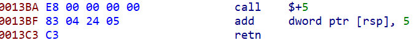

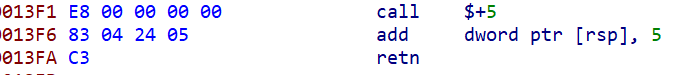

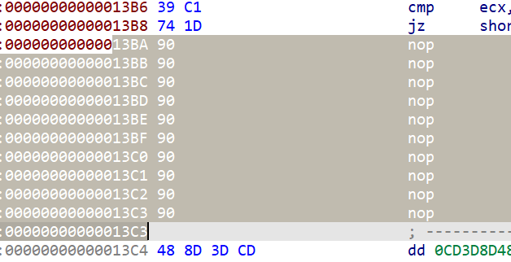

然后转函数就能拿到主函数逻辑：

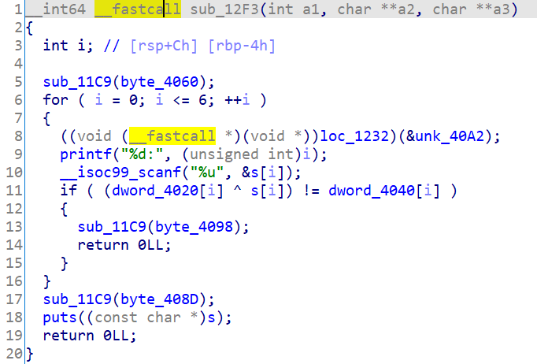

`loc_1232`的地方也是没有识别到的，需要跳过去进行转换。

可以转出来是：

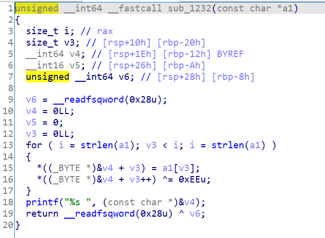

一个printf，又是没什么用的（打印出来的估计是提示信息

所以其实就是让输入的s满足`(dword_4020[i] ^ s[i]) == dword_4040[i]`就可

写wp：

```python
dst = [0x22, 0x5F, 0x43, 0x76, 0x2E, 0x34, 0x5C, 0x56, 0x07, 0x21, 0x37, 0x5C, 0x28, 0x15, 0x3A, 0x1B, 0xFE, 0x12, 0x01, 0x30, 0xED, 0xE9, 0x15, 0x0A, 0x65, 0xB8, 0xF5, 0x77, 0x00, 0x00, 0x00, 0x00]
arr = [0x44, 0x33, 0x22, 0x11, 0x55, 0x44, 0x33, 0x22, 0x66, 0x55, 0x44, 0x33, 0x77, 0x66, 0x55, 0x44, 0x88, 0x77, 0x66, 0x55, 0x99, 0x88, 0x77, 0x66, 0x00, 0x99, 0x88, 0x77, 0x00, 0x00, 0x00, 0x00]
flag = ""

for i in range(len(dst)):
    flag += chr(dst[i]^arr[i])

print(flag)
```

flag：**flag{potatso_so_vegetable!}**

## ezMath

拖进ida发现很诡异，可以用ExEinfoPE等查壳软件看到有upx壳。

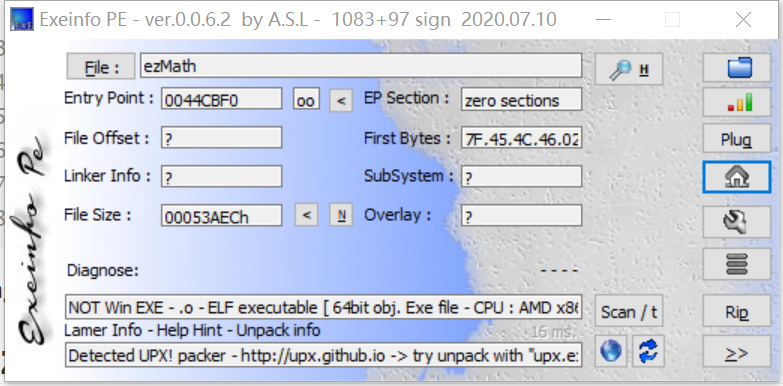

用upx 3.94版本能直接脱壳（神奇），高版本因为magic字节被出题人 ~~（也就是我）~~ 魔改所以会报`l_info`的错误（

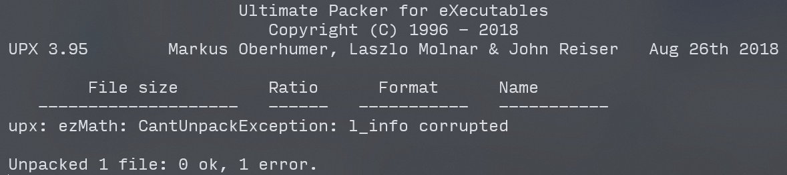

通过这篇[文章](https://cujo.com/upx-anti-unpacking-techniques-in-iot-malware/)可以知道l_info实际上是前面的一段header（不同版本的upx有不同的offset）

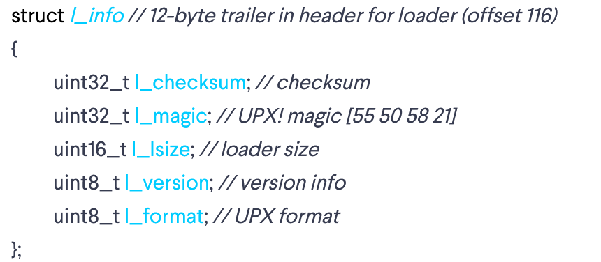

正常来说一个upx加壳文件会出现三次magic字节（`UPX!`，还是在那篇文章中可以看到是被魔改的`YTS\x99`，如下图），一次在头部，两次在尾部。

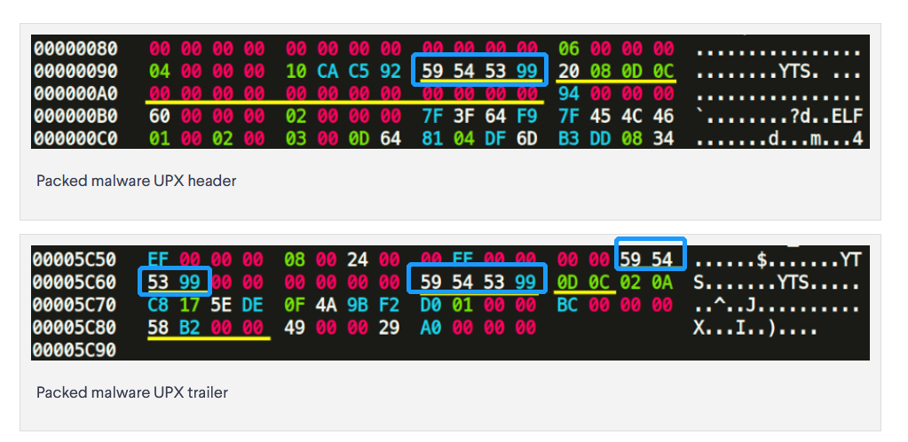

可以看到在头部的magic字节后的第三第四字节是`0D 0C`，而尾部最后一个magic字节后紧跟着的两个字节也是`0D 0C`，实际上这两个字节正是标明版本相关（具体不用管hhh，反正就在这个位置就对了）。

于是类推一下可以找到这个文件头部被魔改的magic应该在哪里：

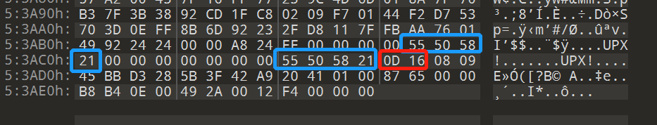

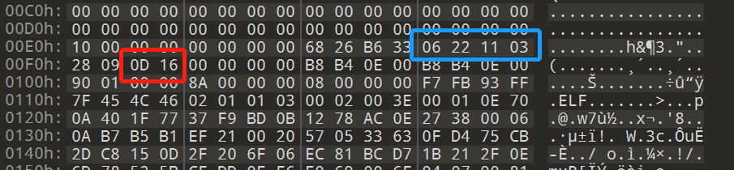

所以`06 22 11 03`部分应为`UPX!`（这里埋了个小彩蛋嘿嘿，dddd

所以把这里改成`UPX!`就可以正常脱壳啦~

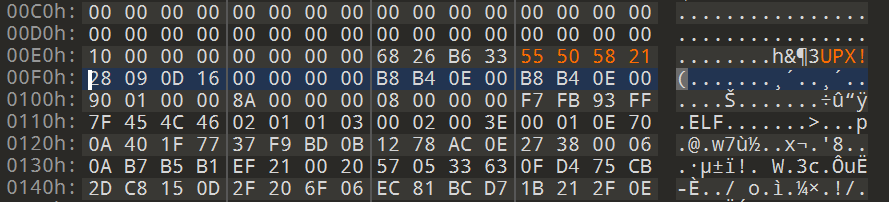

脱壳以后开始分析，发现这是一个简单的交互，要回答所有式子的答案，全部正确以后就可以获得flag。

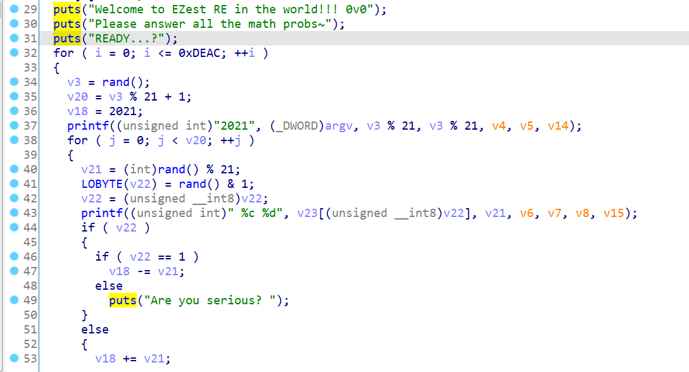

然而要回答0xDEAD次，所以必不可能是手答（整整五万多次呢）

有两种思路，一是Python写个自动交互计算的程序，然后摁跑，模拟手答：

```python
from pwn import *
from hashlib import md5

# context.log_level = 'debug'
r = process("./ezMath")
end = 'Congratulations!'
flag = ''

r.readline()
r.readline()
r.readline()

while True:
    cal = r.readline()
    if cal[:len(end)] == end:
        print(cal)
        break
    ans = str(eval(cal))
    flag += ans
    r.sendline(ans)
    if r.readline() != 'OK! \n':
        print("???")

print("flag{" + md5(flag.encode()).hexdigest() + "}")
r.interactive()
```

题目也有写，最后flag是交md5

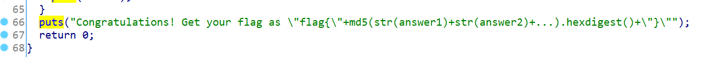

所以过十几秒就能跑出flag：

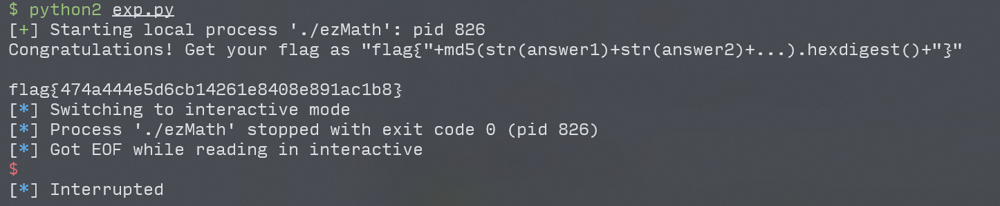

二是模拟程序执行的逻辑，手动把所有的答案都算出来，毕竟随机数种子都给了，直接cv一下重现ida里的代码就好：

```c
#include <stdio.h>
#include <stdlib.h>

int main(int argc, const char **argv, const char **envp)
{
  int v3; // eax
  int v4; // er8
  int v5; // er9
  int v6; // ecx
  int v7; // er8
  int v8; // er9
  int v9; // edx
  int v10; // ecx
  int v11; // er8
  int v12; // er9
  char v14; // [rsp+0h] [rbp-30h]
  char v15; // [rsp+0h] [rbp-30h]
  int v16; // [rsp+8h] [rbp-28h] BYREF
  int i; // [rsp+Ch] [rbp-24h]
  int v18; // [rsp+10h] [rbp-20h]
  int j; // [rsp+14h] [rbp-1Ch]
  int v20; // [rsp+18h] [rbp-18h]
  int v21; // [rsp+1Ch] [rbp-14h]
  int v22; // [rsp+20h] [rbp-10h]
  char v23[2]; // [rsp+26h] [rbp-Ah]
  // unsigned __int64 v24; // [rsp+28h] [rbp-8h]

  // v24 = __readfsqword(0x28u);
  srandom(8225);
  v23[0] = 43;
  v23[1] = 45;
  // puts("Welcome to EZest RE in the world!!! 0v0");
  // puts("Please answer all the math probs~");
  // puts("READY...?");
  for ( i = 0; i <= 57004; ++i )
  {
    v3 = rand();
    v20 = v3 % 21 + 1;
    v18 = 2021;
    // printf((unsigned int)"2021", (_DWORD)argv, v3 % 21, v3 % 21, v4, v5, v14);
    for ( j = 0; j < v20; ++j )
    {
      v21 = (int)rand() % 21;
      v22 = rand() & 1;
      // v22 = (unsigned __int8)v22;
      // printf((unsigned int)" %c %d", v23[(unsigned __int8)v22], v21, v6, v7, v8, v15);
      if ( v22 )
      {
        if ( v22 == 1 )
          v18 -= v21;
        else
          puts("Are you serious? ");
      }
      else
      {
        v18 += v21;
      }
    }
    printf("%d", v18);
    // putchar(10LL);
    // argv = (const char **)&v16;
    // _isoc99_scanf((unsigned int)"%d", (unsigned int)&v16, v9, v10, v11, v12, v15);
    // if ( v18 != v16 )
    // {
    //   puts("Try again and try again~ ");
    //   return 0;
    // }
    // puts("OK! ");
  }
  // puts("Congratulations! Get your flag as \"flag{\"+md5(str(answer1)+str(answer2)+...).hexdigest()+\"}\"");
  return 0;
}
```

然后把结果存到`exp2.txt`里，最后对所有答案进行md5操作：

```python
from hashlib import md5

with open('exp2.txt', 'r') as f:
    ans = f.read().strip()

print("flag{" + md5(ans.encode()).hexdigest() + "}")
```

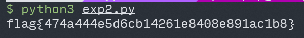

flag：**flag{474a444e5d6cb14261e8408e891ac1b8}**

## babyvm

啊~ VM题出得累死累活的，又累出题人又累选手，flag还那么棒 ~~（究极拉仇恨）~~ ，结果居然没人做TAT ~~（防AK大成功~~

没什么好说的啦，就硬逆呗，记住每个opcode的作用然后写个解析器就ok了（符号表都没去，手下留情了555）

剩下的就是看汇编=v=

解析器：

```python
ins_set={
    0x00:[1,0,"exit"],
    0x01:[3,2,"mov r{0},0x{1:0>2X}"],
    0x11:[3,2,"mov r{0},r{1}"],
    0x21:[3,2,"mov [r{0}],0x{1:0>2X}"],
    0x31:[3,2,"mov [r{0}],r{1}"],
    0x02:[2,1,"inc r{0}"],
    0x03:[2,1,"push r{0}"],
    0x04:[2,1,"pop r{0}"],
    0x05:[2,1,"r{0} = getchar()"],
    0x06:[2,1,"putchar(r{0})"],
    0x07:[3,2,"cmp r{0},0x{1:0>2X}"],
    0x17:[3,2,"cmp [r{0}],[r{1}]"],
    0x08:[2,1,"jnz {0:0>4}"],
    0x18:[2,1,"jmp {0:0>4}"],
    0x09:[3,2,"xor [r{0}],0x{1:0>2X}"],
    0x19:[3,2,"xor [r{0}],r{1}"],
    0x0A:[3,2,"add [r{0}],0x{1:0>2X}"],
    0x0B:[3,2,"sub r{0},0x{1:0>2X}"],
}
opcode=\
[0x01, 0x01, 0x00, 0x21, 0x01, 0x0A, 0x02, 0x01, 0x21, 0x01, 0x01, 0x02, 0x01, 0x21, 0x01, 0x0F, 0x02, 0x01, 0x21, 0x01, 0x08, 0x02, 0x01, 0x21, 0x01, 0x13, 0x02, 0x01, 0x21, 0x01, 0x7D, 0x02, 0x01, 0x21, 0x01, 0x5A, 0x02, 0x01, 0x21, 0x01, 0x1D, 0x02, 0x01, 0x21, 0x01, 0x01, 0x02, 0x01, 0x21, 0x01, 0x17, 0x02, 0x01, 0x21, 0x01, 0x79, 0x02, 0x01, 0x21, 0x01, 0x56, 0x02, 0x01, 0x21, 0x01, 0x13, 0x02, 0x01, 0x21, 0x01, 0x7E, 0x02, 0x01, 0x21, 0x01, 0x0F, 0x02, 0x01, 0x21, 0x01, 0x1A, 0x02, 0x01, 0x21, 0x01, 0x63, 0x02, 0x01, 0x21, 0x01, 0x1F, 0x02, 0x01, 0x21, 0x01, 0x11, 0x02, 0x01, 0x21, 0x01, 0x06, 0x02, 0x01, 0x21, 0x01, 0x1E, 0x02, 0x01, 0x21, 0x01, 0x0B, 0x02, 0x01, 0x21, 0x01, 0x13, 0x02, 0x01, 0x21, 0x01, 0x48, 0x02, 0x01, 0x21, 0x01, 0x1A, 0x02, 0x01, 0x21, 0x01, 0x11, 0x02, 0x01, 0x21, 0x01, 0x69, 0x02, 0x01, 0x21, 0x01, 0x1F, 0x02, 0x01, 0x21, 0x01, 0x44, 0x02, 0x01, 0x21, 0x01, 0x19, 0x02, 0x01, 0x21, 0x01, 0x13, 0x02, 0x01, 0x21, 0x01, 0x0E, 0x02, 0x01, 0x01, 0x01, 0x57, 0x06, 0x01, 0x01, 0x01, 0x68, 0x06, 0x01, 0x01, 0x01, 0x61, 0x06, 0x01, 0x01, 0x01, 0x74, 0x06, 0x01, 0x01, 0x01, 0x20, 0x06, 0x01, 0x01, 0x01, 0x69, 0x06, 0x01, 0x01, 0x01, 0x73, 0x06, 0x01, 0x01, 0x01, 0x20, 0x06, 0x01, 0x01, 0x01, 0x79, 0x06, 0x01, 0x01, 0x01, 0x6F, 0x06, 0x01, 0x01, 0x01, 0x75, 0x06, 0x01, 0x01, 0x01, 0x72, 0x06, 0x01, 0x01, 0x01, 0x20, 0x06, 0x01, 0x01, 0x01, 0x66, 0x06, 0x01, 0x01, 0x01, 0x6C, 0x06, 0x01, 0x01, 0x01, 0x61, 0x06, 0x01, 0x01, 0x01, 0x67, 0x06, 0x01, 0x01, 0x01, 0x3F, 0x06, 0x01, 0x01, 0x01, 0x0A, 0x06, 0x01, 0x01, 0x01, 0x00, 0x05, 0x02, 0x03, 0x02, 0x02, 0x01, 0x07, 0x01, 0x20, 0x08, 0xF5, 0x01, 0x01, 0x00, 0x0A, 0x01, 0x40, 0x02, 0x01, 0x07, 0x01, 0x20, 0x08, 0xF6, 0x01, 0x01, 0x40, 0x04, 0x02, 0x0B, 0x01, 0x01, 0x31, 0x01, 0x02, 0x07, 0x01, 0x20, 0x08, 0xF3, 0x01, 0x01, 0x20, 0x11, 0x02, 0x01, 0x0B, 0x02, 0x20, 0x19, 0x01, 0x02, 0x02, 0x01, 0x07, 0x01, 0x40, 0x08, 0xF0, 0x01, 0x01, 0x20, 0x0A, 0x01, 0x20, 0x02, 0x01, 0x07, 0x01, 0x40, 0x08, 0xF6, 0x01, 0x01, 0x00, 0x01, 0x02, 0x20, 0x09, 0x01, 0xCC, 0x17, 0x01, 0x02, 0x08, 0x2E, 0x02, 0x01, 0x02, 0x02, 0x07, 0x01, 0x20, 0x08, 0xEF, 0x01, 0x01, 0x52, 0x06, 0x01, 0x01, 0x01, 0x69, 0x06, 0x01, 0x01, 0x01, 0x67, 0x06, 0x01, 0x01, 0x01, 0x68, 0x06, 0x01, 0x01, 0x01, 0x74, 0x06, 0x01, 0x01, 0x01, 0x21, 0x06, 0x01, 0x01, 0x01, 0x0A, 0x06, 0x01, 0x18, 0x23, 0x01, 0x01, 0x57, 0x06, 0x01, 0x01, 0x01, 0x72, 0x06, 0x01, 0x01, 0x01, 0x6F, 0x06, 0x01, 0x01, 0x01, 0x6E, 0x06, 0x01, 0x01, 0x01, 0x67, 0x06, 0x01, 0x01, 0x01, 0x21, 0x06, 0x01, 0x01, 0x01, 0x0A, 0x06, 0x01, 0x00]
pc=0
res=["Addr          Code\n"]
addrfmt="{0:0>4}    "
while pc<len(opcode):
    i=pc
    pc+=ins_set[opcode[i]][0]
    res.append(addrfmt.format(i))
    if opcode[i] not in ins_set.keys(): #如果指令集中不存在该opcode
        print("[-] UknOpcode 0x{0:X} in addr 0x{1:0>8X}.\n".format(opcode[i],i))
        break
    elif opcode[i]==0x08 or opcode[i]==0x18:
        jmpdelta=opcode[i+1] if opcode[i+1]&0x80==0 else opcode[i+1]-256
        res.append(ins_set[opcode[i]][2].format(pc+jmpdelta)+'\n')
    else: #一般opcode的处理
        args=[]
        for j in range(ins_set[opcode[i]][1]):
            args.append(opcode[i+1+j])
        res.append(ins_set[opcode[i]][2].format(*args)+'\n')
        if opcode[i]==0:
            break

with open('res.txt','w') as f:
    f.writelines(res)
```

得到的`res.txt`：

```assembly
Addr          Code
0000    mov r1,0x00
0003    mov [r1],0x0A
0006    inc r1
0008    mov [r1],0x01
0011    inc r1
0013    mov [r1],0x0F
0016    inc r1
0018    mov [r1],0x08
0021    inc r1
0023    mov [r1],0x13
0026    inc r1
0028    mov [r1],0x7D
0031    inc r1
0033    mov [r1],0x5A
0036    inc r1
0038    mov [r1],0x1D
0041    inc r1
0043    mov [r1],0x01
0046    inc r1
0048    mov [r1],0x17
0051    inc r1
0053    mov [r1],0x79
0056    inc r1
0058    mov [r1],0x56
0061    inc r1
0063    mov [r1],0x13
0066    inc r1
0068    mov [r1],0x7E
0071    inc r1
0073    mov [r1],0x0F
0076    inc r1
0078    mov [r1],0x1A
0081    inc r1
0083    mov [r1],0x63
0086    inc r1
0088    mov [r1],0x1F
0091    inc r1
0093    mov [r1],0x11
0096    inc r1
0098    mov [r1],0x06
0101    inc r1
0103    mov [r1],0x1E
0106    inc r1
0108    mov [r1],0x0B
0111    inc r1
0113    mov [r1],0x13
0116    inc r1
0118    mov [r1],0x48
0121    inc r1
0123    mov [r1],0x1A
0126    inc r1
0128    mov [r1],0x11
0131    inc r1
0133    mov [r1],0x69
0136    inc r1
0138    mov [r1],0x1F
0141    inc r1
0143    mov [r1],0x44
0146    inc r1
0148    mov [r1],0x19
0151    inc r1
0153    mov [r1],0x13
0156    inc r1
0158    mov [r1],0x0E
0161    inc r1
0163    mov r1,0x57
0166    putchar(r1)
0168    mov r1,0x68
0171    putchar(r1)
0173    mov r1,0x61
0176    putchar(r1)
0178    mov r1,0x74
0181    putchar(r1)
0183    mov r1,0x20
0186    putchar(r1)
0188    mov r1,0x69
0191    putchar(r1)
0193    mov r1,0x73
0196    putchar(r1)
0198    mov r1,0x20
0201    putchar(r1)
0203    mov r1,0x79
0206    putchar(r1)
0208    mov r1,0x6F
0211    putchar(r1)
0213    mov r1,0x75
0216    putchar(r1)
0218    mov r1,0x72
0221    putchar(r1)
0223    mov r1,0x20
0226    putchar(r1)
0228    mov r1,0x66
0231    putchar(r1)
0233    mov r1,0x6C
0236    putchar(r1)
0238    mov r1,0x61
0241    putchar(r1)
0243    mov r1,0x67
0246    putchar(r1)
0248    mov r1,0x3F
0251    putchar(r1)
0253    mov r1,0x0A
0256    putchar(r1)
0258    mov r1,0x00
0261    r2 = getchar()
0263    push r2
0265    inc r1
0267    cmp r1,0x20
0270    jnz 0261
0272    mov r1,0x00
0275    add [r1],0x40
0278    inc r1
0280    cmp r1,0x20
0283    jnz 0275
0285    mov r1,0x40
0288    pop r2
0290    sub r1,0x01
0293    mov [r1],r2
0296    cmp r1,0x20
0299    jnz 0288
0301    mov r1,0x20
0304    mov r2,r1
0307    sub r2,0x20
0310    xor [r1],r2
0313    inc r1
0315    cmp r1,0x40
0318    jnz 0304
0320    mov r1,0x20
0323    add [r1],0x20
0326    inc r1
0328    cmp r1,0x40
0331    jnz 0323
0333    mov r1,0x00
0336    mov r2,0x20
0339    xor [r1],0xCC
0342    cmp [r1],[r2]
0345    jnz 0393
0347    inc r1
0349    inc r2
0351    cmp r1,0x20
0354    jnz 0339
0356    mov r1,0x52
0359    putchar(r1)
0361    mov r1,0x69
0364    putchar(r1)
0366    mov r1,0x67
0369    putchar(r1)
0371    mov r1,0x68
0374    putchar(r1)
0376    mov r1,0x74
0379    putchar(r1)
0381    mov r1,0x21
0384    putchar(r1)
0386    mov r1,0x0A
0389    putchar(r1)
0391    jmp 0428
0393    mov r1,0x57
0396    putchar(r1)
0398    mov r1,0x72
0401    putchar(r1)
0403    mov r1,0x6F
0406    putchar(r1)
0408    mov r1,0x6E
0411    putchar(r1)
0413    mov r1,0x67
0416    putchar(r1)
0418    mov r1,0x21
0421    putchar(r1)
0423    mov r1,0x0A
0426    putchar(r1)
0428    exit
```

很标~准的汇编啦，稍微捋捋逻辑就出来了：

```python
dst = [10, 1, 15, 8, 19, 125, 90, 29, 1, 23, 121, 86, 19, 126, 15, 26, 99, 31, 17, 6, 30, 11, 19, 72, 26, 17, 105, 31, 68, 25, 19, 14]
flag = []

for i in range(32):
    flag.append((((dst[i]+64)^0xCC)-32)^i)

print(''.join(map(chr,flag)))
```

flag：**flag{T0ver_1s_my_boyfri3nd_h4ha}**

